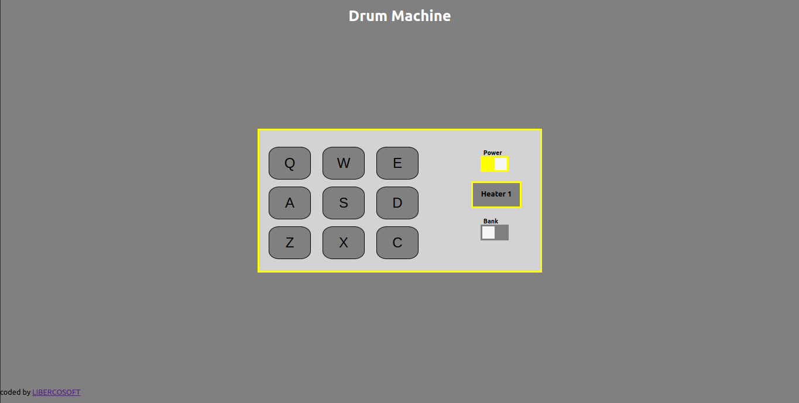

# 📗 Table of Contents

- [📗 Table of Contents](#-table-of-contents)
- [📖 Drum Machine ](#-drum-machine-)
  - [🛠 Built With ](#-built-with-)
    - [Tech Stack ](#tech-stack-)
    - [Key Features ](#key-features-)
  - [🚀 Live Demo ](#-live-demo-)
  - [💻 Getting Started ](#-getting-started-)
    - [Prerequisites](#prerequisites)
    - [Setup](#setup)
    - [Install](#install)
    - [Usage](#usage)
  - [👥 Authors ](#-authors-)
  - [🔭 Future Features ](#-future-features-)
  - [🤝 Contributing](#-contributing)
  - [Show your support](#show-your-support)
  - [📝 License](#-license)

<!-- PROJECT DESCRIPTION -->

# 📖 Drum Machine <a name="about-project"></a>

**Drum Machine** is a web based drum pad that plays a sound when a selected button is clicked on screen or on the keyboard.


## 🛠 Built With <a name="built-with"></a>

### Tech Stack <a name="tech-stack"></a>

<details>
  <summary>Client</summary>
  <ul>
    <li><a href="https://reactjs.org/">React.js</a></li>
  </ul>
</details>

<!-- Features -->

### Key Features <a name="key-features"></a>

- **User can switch between a drum and paino**
- **User can click on the keys onsreen or through the keyboard**

<p align="right">(<a href="#readme-top">back to top</a>)</p>

<!-- LIVE DEMO -->

## 🚀 Live Demo <a name="live-demo"></a>

- [Live Demo Link](https://drum-machine-libercosoft.netlify.app/)

<p align="right">(<a href="#readme-top">back to top</a>)</p>

<!-- GETTING STARTED -->

## 💻 Getting Started <a name="getting-started"></a>

To get a local copy up and running, follow these steps.

### Prerequisites

In order to run this project you need:

- Have Git installed on your computer or laptop
- Have Node installed on your computer or laptop

### Setup

Clone this repository to your desired folder:

```sh
  mkdir desired-folder
  cd desired-folder
  git clone git@github.com:LIBERCOSOFT/drum-machine.git - for SSH
  git clone https://github.com/LIBERCOSOFT/drum-machine.git - for HTTPS
```

### Install

Install this project with:

```sh
 npm install
```

### Usage

To run the project, execute the following command:

```sh
 npm start
```


<p align="right">(<a href="#readme-top">back to top</a>)</p>

<!-- AUTHORS -->

## 👥 Authors <a name="authors"></a>

👤 **Kolapo Precious Akinrinlola**

- GitHub: [@LIBERCOSOFT](https://github.com/LIBERCOSOFT)
- Twitter: [@Gerfieldt](https://twitter.com/Gerfieldt)
- Linkedin: [@Kolapo Akinrinlola](https://www.linkedin.com/in/kolapo-akinrinlola-072097110)


<p align="right">(<a href="#readme-top">back to top</a>)</p>

<!-- FUTURE FEATURES -->

## 🔭 Future Features <a name="future-features"></a>

- [ ] **Add more keys to the drum**
- [ ] **Add more keys to the piano**

<p align="right">(<a href="#readme-top">back to top</a>)</p>

<!-- CONTRIBUTING -->

## 🤝 Contributing

Contributions, issues, and feature requests are welcome!
Feel free to check the [issues page](https://github.com/LIBERCOSOFT/drum-machine/issues)

## Show your support

Give a ⭐️ if you like this project!

## 📝 License

This project is [MIT](./LICENSE) licensed.

<p align="right">(<a href="#readme-top">back to top</a>)</p>